# OpenAI Inference Proxy

A secure, enterprise-ready proxy for OpenAI's Responses API with advanced authentication, user management, usage tracking, and audit capabilities.

## 🌟 Overview

This proxy acts as an intelligent intermediary between your applications and OpenAI's API, providing:

- **Security**: JWT-based authentication with organization isolation
- **Access Control**: User-scoped and organization-wide API key management
- **Audit Trail**: Complete request tracking with user attribution
- **Cost Management**: Real-time usage tracking and cost calculation
- **Flexibility**: Support for both streaming and non-streaming responses
- **User Experience**: Response rating system for quality feedback

### Key Benefits

- 🔒 **Enhanced Security**: Never expose OpenAI API keys to client applications
- 📊 **Usage Analytics**: Track costs and usage patterns by user and organization
- 🎯 **Fine-grained Control**: Assign different API keys to different users
- 📝 **Compliance Ready**: Full audit trail for all API interactions
- 🚀 **Production Ready**: Docker deployment with health monitoring

## 🏗️ Architecture

```mermaid
flowchart TD
    classDef clients fill:#f9f9f9,stroke:#333,stroke-width:2px
    classDef proxy fill:#e6f7ff,stroke:#0066cc,stroke-width:2px
    classDef proxyComponents fill:#cceeff,stroke:#0066cc,stroke-width:1px
    classDef database fill:#f0f0f0,stroke:#666666,stroke-width:2px
    classDef openai fill:#f0fff0,stroke:#006600,stroke-width:2px
    
    clients[Client Applications\nWeb, Mobile, Desktop]:::clients
    
    proxy[OpenAI Inference Proxy]:::proxy
    
    auth[Authentication & Authorization\n• JWT validation\n• Organization verification\n• User identification]:::proxyComponents
    keyMgmt[API Key Management\n• User-scoped keys\n• Organization-wide keys\n• Encrypted storage]:::proxyComponents
    reqProc[Request Processing\n• Session management\n• Usage tracking\n• Cost calculation\n• Response streaming]:::proxyComponents
    
    db[PostgreSQL Database\n• Organizations • API Keys\n• Users • Sessions\n• Requests • Usage Logs]:::database
    
    oai[OpenAI API]:::openai
    
    clients -- HTTPS + JWT Auth --> proxy
    proxy --> auth
    proxy --> keyMgmt
    proxy --> reqProc
    proxy --> db
    db --> oai
    
    %% Add relationship labels and styling
    linkStyle 0 stroke:#0066cc,stroke-width:2px
    linkStyle 4 stroke:#006600,stroke-width:2px
```



## ✨ Features

### Core Features

- 🔐 **JWT Authentication**: Secure API access with organization-level JWT tokens
- 🔑 **Dual API Key Scoping**: 
  - **User-scoped keys**: Restrict API access to specific users
  - **Organization-wide keys**: Shared access for all users in an organization
- 👥 **Automatic User Management**: Users are created on-demand when they make their first request
- 📊 **Comprehensive Usage Tracking**: Monitor token usage and costs per user, session, and organization
- ⭐ **Response Rating**: Users can rate AI responses with feedback
- 🌐 **Browser Compatible**: Full CORS support for web applications
- 🚀 **Streaming Support**: Efficient handling of both streaming and non-streaming responses
- 📝 **Session Management**: Group related requests for better tracking
- 💰 **Real-time Cost Calculation**: Automatic cost calculation based on current model pricing
- 🐳 **Docker Ready**: Production-ready Docker configuration

### Security Features

- 🔒 **Encrypted API Keys**: All OpenAI API keys are encrypted at rest using Fernet
- 🛡️ **Organization Isolation**: Complete data isolation between organizations
- 🔍 **Audit Trail**: Every request is logged with user attribution
- 🚦 **Rate Limiting**: Built-in rate limiting support (extensible with Redis)

## 🚀 Quick Start

### Prerequisites

- Python 3.11+ or Docker
- PostgreSQL 15+ (or use Docker)
- An OpenAI API key

### Fastest Setup (Recommended)

Use the automated quickstart script:

```bash
./scripts/quickstart.sh
```

This interactive script will:
1. Create a `.env` file from the template
2. Generate secure encryption keys automatically
3. Start PostgreSQL and API containers with Docker
4. Walk you through creating your organization
5. Help you add your OpenAI API key
6. Generate a JWT token for authentication
7. Provide a ready-to-use curl command to test the API

### Manual Docker Setup

If you prefer to set up manually:

```bash
# Clone the repository
git clone https://github.com/yourusername/openai-inference-proxy.git
cd openai-inference-proxy

# Copy and configure environment
cp .env.example .env

# Generate encryption keys
python3 -c "from cryptography.fernet import Fernet; print('ENCRYPTION_KEY=' + Fernet.generate_key().decode())"
python3 -c "import secrets; print('JWT_SECRET_KEY=' + secrets.token_urlsafe(32))"
# Add these keys to your .env file

# Start all services
docker-compose -f docker/docker-compose.yml up -d

# Create your first organization
docker exec openai-proxy-api python scripts/manage_api_keys.py create-org "My Company"
```

## 📖 Entity Management

### Organizations

Organizations are the top-level entity that owns everything else. They must be created manually using the CLI.

```bash
# Using Docker
docker exec openai-proxy-api python scripts/manage_api_keys.py create-org "My Company"

# Or directly
python scripts/manage_api_keys.py create-org "My Company"
```

### Users

Users belong to organizations and are identified by an external ID (like email or username).

**Automatic Creation**: Users are automatically created when they make their first request with a new X-User-ID header.

**Manual Creation**:
```bash
# Using Docker
docker exec openai-proxy-api python scripts/manage_users.py create-user <org-id> "user@example.com"

# List users
docker exec openai-proxy-api python scripts/manage_users.py list-users --org-id <org-id>
```

### API Keys

API keys can be scoped to either an organization (shared) or a specific user (restricted).

#### Organization-wide Keys
Accessible by any user in the organization:

```bash
docker exec openai-proxy-api python scripts/manage_api_keys.py create-key \
  <org-id> <openai-api-key> \
  --name "Shared Production Key"
```

#### User-scoped Keys
Restricted to a specific user for audit compliance:

```bash
# First create the user (or let them auto-create)
USER_ID=$(docker exec openai-proxy-api python scripts/manage_users.py create-user <org-id> "alice@example.com" | grep "Internal ID:" | awk '{print $3}')

# Then create a key for that user
docker exec openai-proxy-api python scripts/manage_api_keys.py create-key \
  <org-id> <openai-api-key> \
  --user-id $USER_ID \
  --name "Alice's Personal Key"
```

**Key Resolution Priority**:
1. User-specific key (if exists and active)
2. Organization-wide key (fallback)
3. 403 Forbidden (if no keys available)

## 🔧 Configuration

### Environment Variables

| Variable | Description | Required | Default |
|----------|-------------|----------|---------|
| `DATABASE_URL` | PostgreSQL connection string | Yes | - |
| `JWT_SECRET_KEY` | Secret key for JWT signing (min 32 chars) | Yes | - |
| `ENCRYPTION_KEY` | Fernet key for API key encryption | Yes | - |
| `OPENAI_API_BASE_URL` | OpenAI API base URL | No | https://api.openai.com/v1 |
| `CORS_ORIGINS` | Allowed CORS origins (comma-separated) | No | http://localhost:3000,http://localhost:8080 |
| `LOG_LEVEL` | Logging level (DEBUG, INFO, WARNING, ERROR) | No | INFO |
| `HOST` | Server host | No | 0.0.0.0 |
| `PORT` | Server port | No | 8000 |
| `JWT_ALGORITHM` | JWT signing algorithm | No | HS256 |
| `JWT_EXPIRATION_DAYS` | JWT token validity period | No | 365 |
| `REQUEST_TIMEOUT` | Request timeout in seconds | No | 600 |
| `MAX_RETRIES` | Maximum retry attempts | No | 3 |
| `RATE_LIMIT_REQUESTS` | Requests per minute | No | 60 |

### Generating Secure Keys

```bash
# Generate Fernet encryption key
docker exec openai-proxy-api python scripts/manage_api_keys.py generate-fernet-key

# Generate JWT secret (or use any secure random string generator)
openssl rand -base64 32
```

## 📡 API Usage

### Authentication

All API requests require a JWT token in the Authorization header:

```
Authorization: Bearer <jwt-token>
```

Generate a JWT token:
```bash
docker exec openai-proxy-api python scripts/create_jwt.py \
  --org-name "My Company" \
  --org-id <org-id> \
  --days 365
```

### Making Requests

#### Non-Streaming Request

```bash
curl -X POST http://localhost:8000/v1/responses \
  -H "Authorization: Bearer <jwt-token>" \
  -H "X-User-ID: alice@example.com" \
  -H "X-Session-ID: session-123" \
  -H "Content-Type: application/json" \
  -d '{
    "model": "gpt-4o",
    "input": "Explain quantum computing in simple terms",
    "stream": false,
    "max_output_tokens": 150
  }'
```

#### Streaming Request (JavaScript)

```javascript
const response = await fetch('http://localhost:8000/v1/responses', {
  method: 'POST',
  headers: {
    'Authorization': 'Bearer <jwt-token>',
    'X-User-ID': 'alice@example.com',
    'X-Session-ID': 'session-123',
    'Content-Type': 'application/json'
  },
  body: JSON.stringify({
    model: 'gpt-4o',
    input: 'Write a short story about a robot',
    stream: true
  })
});

const reader = response.body.getReader();
const decoder = new TextDecoder();

while (true) {
  const { done, value } = await reader.read();
  if (done) break;
  
  const chunk = decoder.decode(value);
  const lines = chunk.split('\n');
  
  for (const line of lines) {
    if (line.startsWith('data: ')) {
      const data = JSON.parse(line.slice(6));
      if (data.content) {
        console.log(data.content[0].text);
      }
    }
  }
}
```

#### Python Client Example

```python
import requests
import json

# Configuration
api_url = "http://localhost:8000/v1/responses"
jwt_token = "your-jwt-token"
user_id = "alice@example.com"

# Make a request
response = requests.post(
    api_url,
    headers={
        "Authorization": f"Bearer {jwt_token}",
        "X-User-ID": user_id,
        "Content-Type": "application/json"
    },
    json={
        "model": "gpt-4o",
        "input": "What is the meaning of life?",
        "stream": False,
        "temperature": 0.7
    }
)

# Handle response
if response.status_code == 200:
    data = response.json()
    print(data["content"][0]["text"])
    print(f"Tokens used: {data['usage']['total_tokens']}")
else:
    print(f"Error: {response.status_code}")
    print(response.json())
```

### Rating Responses

Users can rate responses using either the request ID or response ID:

```bash
# Rate by request ID
curl -X POST http://localhost:8000/v1/responses/req_abc123/rate \
  -H "Authorization: Bearer <jwt-token>" \
  -H "Content-Type: application/json" \
  -d '{
    "rating": 1,
    "feedback": "Very helpful and accurate!"
  }'

# Rate by response ID
curl -X POST http://localhost:8000/v1/responses/resp_xyz789/rate \
  -H "Authorization: Bearer <jwt-token>" \
  -H "Content-Type: application/json" \
  -d '{
    "rating": -1,
    "feedback": "Response was not relevant to my question"
  }'
```

## 📚 API Reference

### Main Endpoints

#### `POST /v1/responses`
Proxy a request to OpenAI's Responses API.

**Headers:**
- `Authorization: Bearer <jwt-token>` (required)
- `X-User-ID: <external-user-id>` (required)
- `X-Session-ID: <session-id>` (optional)

**Request Body:**
```json
{
  "model": "gpt-4o",
  "input": "Your prompt here",
  "stream": false,
  "temperature": 0.7,
  "max_output_tokens": 150,
  "top_p": 1.0,
  "frequency_penalty": 0.0,
  "presence_penalty": 0.0
}
```

**Response Headers:**
- `X-Request-ID`: Unique request identifier
- `X-Session-ID`: Session identifier

#### `GET /v1/responses/{response_id}`
Retrieve a response from OpenAI by its ID.

#### `POST /v1/responses/{id}/rate`
Rate a response (accepts either request_id or response_id).

**Request Body:**
```json
{
  "rating": 1,  // 1 for positive, -1 for negative
  "feedback": "Optional feedback text"
}
```

### Management Endpoints

#### `GET /v1/users`
List users in the organization (requires JWT auth).

#### `POST /v1/users`
Create a new user.

#### `GET /v1/keys`
List API keys for the organization.

#### `POST /v1/keys`
Create a new API key.

#### `PUT /v1/keys/{key_id}`
Update an API key.

#### `DELETE /v1/keys/{key_id}`
Deactivate an API key.

### Utility Endpoints

- `GET /health` - Health check with OpenAI connectivity test
- `GET /docs` - Interactive Swagger documentation
- `GET /redoc` - ReDoc API documentation

## 🛠️ Management Tools

### JWT Token Management

```bash
# Create a token (Docker)
docker exec openai-proxy-api python scripts/create_jwt.py \
  --org-name "My Company" \
  --org-id <org-id> \
  --days 365

# Create a token (Direct)
python scripts/create_jwt.py --org-name "My Company" --org-id <org-id>
```

### Organization Management

```bash
# Create organization
docker exec openai-proxy-api python scripts/manage_api_keys.py create-org "Company Name"

# List all organizations
docker exec openai-proxy-api python scripts/manage_api_keys.py list-orgs
```

### User Management

```bash
# Create user manually
docker exec openai-proxy-api python scripts/manage_users.py create-user <org-id> "user@example.com"

# List users
docker exec openai-proxy-api python scripts/manage_users.py list-users [--org-id <org-id>]

# Delete user
docker exec openai-proxy-api python scripts/manage_users.py delete-user <user-id>
```

### API Key Management

```bash
# Create organization-wide key
docker exec openai-proxy-api python scripts/manage_api_keys.py create-key \
  <org-id> <openai-api-key> \
  --name "Production Key" \
  --description "Shared key for all users"

# Create user-specific key
docker exec openai-proxy-api python scripts/manage_api_keys.py create-key \
  <org-id> <openai-api-key> \
  --user-id <user-id> \
  --name "Alice's Key" \
  --description "Personal key for Alice"

# List keys
docker exec openai-proxy-api python scripts/manage_api_keys.py list-keys \
  [--org-id <org-id>] [--user-id <user-id>]

# Deactivate key
docker exec openai-proxy-api python scripts/manage_api_keys.py deactivate-key <synthetic-key>
```

## 🧪 Testing

### Run the Comprehensive Test Suite

```bash
# Run all tests
python tests/openai_proxy_test.py
```

This test suite validates:
- JWT authentication
- Organization isolation
- User creation (automatic and manual)
- API key scoping (user vs organization)
- Streaming and non-streaming responses
- Usage tracking and cost calculation
- Response rating functionality
- Error handling and edge cases

### Development Test Scripts

For specific feature testing during development:

```bash
# User-scoped API key tests
./dev-scripts/test_user_scoped_keys.sh

# Other development scripts
ls dev-scripts/
```


## 🔒 Security & Access Control

### Authentication Flow

1. **JWT Generation**: Admin creates JWT token for organization
2. **Request Authentication**: Client includes JWT in Authorization header
3. **User Identification**: X-User-ID header identifies the specific user
4. **Key Resolution**: System finds appropriate API key (user-specific or org-wide)
5. **Request Forwarding**: Proxy forwards to OpenAI with decrypted key

### API Key Precedence

When a user makes a request:
1. System first looks for a user-specific API key
2. If not found, falls back to organization-wide key
3. If neither exists, returns 403 Forbidden

This allows for:
- **Compliance**: Assign specific keys to specific users for audit trails
- **Flexibility**: Use shared keys for general access
- **Security**: Revoke access for individual users without affecting others

### Best Practices

1. **Use HTTPS in Production**: Always encrypt traffic in transit
2. **Rotate Keys Regularly**: Change JWT secrets and API keys periodically
3. **Monitor Usage**: Review usage logs for anomalies
4. **Limit Scope**: Use user-specific keys for sensitive operations
5. **Audit Regularly**: Review user access and API key assignments

## 📊 Database Schema

### Core Tables

- **organizations**: Top-level entities that own all resources
- **users**: Users within organizations (auto-created or manual)
- **api_keys**: Encrypted OpenAI API keys with optional user scoping
- **sessions**: Groups related requests from the same user session
- **requests**: Individual API requests with response tracking
- **usage_logs**: Token usage and cost data for each request

### Key Relationships


## 🚀 Deployment

### Production Deployment with Docker

1. **Prepare Environment**
   ```bash
   # Clone repository
   git clone https://github.com/yourusername/openai-inference-proxy.git
   cd openai-inference-proxy
   
   # Configure environment
   cp .env.example .env
   # Edit .env with production values
   ```

2. **Deploy with Docker Compose**
   ```bash
   docker-compose -f docker/docker-compose.yml up -d
   ```

3. **Initialize First Organization**
   ```bash
   # Create organization
   ORG_ID=$(docker exec openai-proxy-api python scripts/manage_api_keys.py create-org "Your Company" | grep "ID:" | awk '{print $2}')
   
   # Add API key
   docker exec openai-proxy-api python scripts/manage_api_keys.py create-key $ORG_ID your-openai-key
   
   # Generate JWT
   docker exec openai-proxy-api python scripts/create_jwt.py --org-name "Your Company" --org-id $ORG_ID
   ```

### Manual Deployment

1. **Set up PostgreSQL Database**
2. **Configure Environment Variables**
3. **Install Dependencies**
   ```bash
   pip install -r requirements.txt
   ```
4. **Start with Production Server**
   ```bash
   gunicorn app.main:app -w 4 -k uvicorn.workers.UvicornWorker --bind 0.0.0.0:8000
   ```

### Scaling Considerations

- **Database**: Use connection pooling and read replicas
- **Caching**: Implement Redis for rate limiting and session storage
- **Load Balancing**: Deploy multiple instances behind a load balancer
- **Monitoring**: Set up Prometheus/Grafana for metrics
- **Logging**: Centralize logs with ELK stack or similar

## 🔍 Troubleshooting

### Common Issues

#### "No active API key found for organization"
- Verify organization has at least one active API key
- Check if user-specific key exists (if applicable)
- Ensure API key is marked as active

#### "Invalid authentication credentials"
- Verify JWT token is valid and not expired
- Check JWT_SECRET_KEY matches between token generation and validation
- Ensure Authorization header format is correct: `Bearer <token>`

#### "User not found"
- Users are auto-created on first request
- For manual creation, ensure organization ID is correct
- Check X-User-ID header is present in requests

### Debug Commands

```bash
# Check API logs
docker logs openai-proxy-api

# Connect to database
docker exec -it openai-inference-proxy-db psql -U postgres -d openai_proxy

# List active API keys for an org
docker exec openai-proxy-api python scripts/manage_api_keys.py list-keys --org-id <org-id>

# Verify JWT token
# Use the /health endpoint with your token to test authentication
```

### Database Queries for Debugging

```sql
-- Check organization's API keys
SELECT ak.*, u.user_id as external_user_id 
FROM api_keys ak 
LEFT JOIN users u ON ak.user_id = u.id 
WHERE ak.organization_id = 'your-org-id';

-- View recent requests
SELECT r.*, u.user_id, s.session_id 
FROM requests r 
JOIN sessions s ON r.session_id = s.id 
JOIN users u ON s.user_id = u.id 
ORDER BY r.created_at DESC 
LIMIT 10;

-- Check usage by user
SELECT u.user_id, COUNT(r.id) as request_count, 
       SUM(ul.total_tokens) as total_tokens,
       SUM(ul.total_cost) as total_cost
FROM users u
JOIN sessions s ON u.id = s.user_id
JOIN requests r ON s.id = r.session_id
LEFT JOIN usage_logs ul ON r.id = ul.request_id
GROUP BY u.id, u.user_id;
```

## 📈 Monitoring & Analytics

### Health Monitoring

The `/health` endpoint provides:
- API availability status
- OpenAI connectivity check
- Response time metrics

### Usage Analytics

Track usage patterns with built-in logging:
- Requests per user/organization
- Token consumption by model
- Cost analysis by time period
- Response ratings and feedback

### Example Analytics Queries

```sql
-- Daily usage by organization
SELECT 
    DATE(r.created_at) as date,
    o.name as organization,
    COUNT(r.id) as requests,
    SUM(ul.total_tokens) as tokens,
    SUM(ul.total_cost) as cost
FROM requests r
JOIN sessions s ON r.session_id = s.id
JOIN users u ON s.user_id = u.id
JOIN organizations o ON u.organization_id = o.id
LEFT JOIN usage_logs ul ON r.id = ul.request_id
GROUP BY DATE(r.created_at), o.id, o.name
ORDER BY date DESC;

-- User activity summary
SELECT 
    u.user_id,
    COUNT(DISTINCT s.id) as sessions,
    COUNT(r.id) as total_requests,
    AVG(r.rating) as avg_rating,
    SUM(ul.total_cost) as total_cost
FROM users u
LEFT JOIN sessions s ON u.id = s.user_id
LEFT JOIN requests r ON s.id = r.session_id
LEFT JOIN usage_logs ul ON r.id = ul.request_id
GROUP BY u.id, u.user_id;
```

## 🤝 Contributing

We welcome contributions! Please see our [Contributing Guide](CONTRIBUTING.md) for details.

### Development Setup

1. Fork and clone the repository
2. Create a virtual environment
3. Install development dependencies:
   ```bash
   pip install -r requirements.txt
   pip install -r requirements-dev.txt
   ```
4. Run tests:
   ```bash
   pytest tests/
   ```
5. Format code:
   ```bash
   black app/ scripts/ tests/
   isort app/ scripts/ tests/
   ```

## 📄 License

Apache License 2.0 - see [LICENSE](LICENSE) file for details.

## 🆘 Support

- 📖 [Documentation](docs/)
- 🐛 [Issue Tracker](https://github.com/amotivv-inc/openai-inference-proxy/issues)
- 💬 [Discussions](https://github.com/amotivv-inc/openai-inference-proxy/discussions)
- 📧 Email: ai@amotivv.com

## 🙏 Acknowledgments

- Built with [FastAPI](https://fastapi.tiangolo.com/)
- Database ORM by [SQLAlchemy](https://www.sqlalchemy.org/)
- Async HTTP with [httpx](https://www.python-httpx.org/)
- Deployment with [Docker](https://www.docker.com/)
