# Enterprise AI Gateway

Transform your organization's AI usage from a black box into a transparent, governed, and optimized operation. This gateway provides the missing intelligence layer between your users and AI providers.

## 🎯 The Problem We Solve

While most AI gateways focus on model switching and load balancing, enterprises need deeper intelligence:

- **Who** is using AI across the organization
- **What** they're using it for (intent analysis, conversation patterns)
- **How much** it's costing per user, team, and use case
- **Whether** the AI is delivering value (response ratings, quality metrics)

This gateway bridges the gap between AI infrastructure and AI intelligence.

## 🌟 Overview

This gateway acts as an intelligent intermediary between your applications and AI APIs, providing:

- **Security**: Centralized API key management - users never see actual keys
- **Attribution**: Track every request by user, team, and purpose
- **Analytics**: Built-in conversation analysis for intent, sentiment, and patterns
- **Governance**: Control AI behaviors with personas and access policies
- **Cost Control**: Real-time usage tracking and allocation by cost center
- **Quality Assurance**: Response rating system with feedback loops

### What Makes This Different

#### 1. User-Level Intelligence
Unlike traditional gateways that only track aggregate usage:
- Individual user attribution for every request
- User-scoped API keys for compliance requirements
- Automatic user provisioning with external ID mapping
- Department and team-level usage analytics

#### 2. Conversation Analytics Engine
Built-in AI-powered analysis to understand:
- Intent classification for intelligent routing
- Sentiment analysis for quality monitoring
- Custom classification for business-specific needs
- Pattern recognition across conversations

#### 3. Enterprise-First Architecture
- **Persona Management**: Control AI behaviors at org and user levels
- **Cost Attribution**: Allocate AI spend to specific cost centers
- **Complete Audit Trail**: Every interaction tracked with full context
- **Quality Assurance**: Response rating system with feedback loops

#### 4. Production-Ready Integration
- JWT-based auth integrates with enterprise identity providers
- Session management for conversation continuity
- Standard database backend (PostgreSQL)
- Container-based deployment for modern infrastructure

## 🏗️ Architecture

```mermaid
flowchart TD
    classDef clients fill:#f9f9f9,stroke:#333,stroke-width:2px
    classDef gateway fill:#e6f7ff,stroke:#0066cc,stroke-width:2px
    classDef gatewayComponents fill:#cceeff,stroke:#0066cc,stroke-width:1px
    classDef database fill:#f0f0f0,stroke:#666666,stroke-width:2px
    classDef ai fill:#f0fff0,stroke:#006600,stroke-width:2px
    
    clients["Client Applications
    Web, Mobile, Desktop"]:::clients
    
    gateway["Enterprise AI Gateway"]:::gateway
    
    auth["Authentication & Authorization
    • JWT validation
    • Organization verification
    • User identification"]:::gatewayComponents
    
    keyMgmt["API Key Management
    • User-scoped keys
    • Organization-wide keys
    • Encrypted storage"]:::gatewayComponents
    
    reqProc["Request Processing
    • Session management
    • Usage tracking
    • Cost calculation
    • Response streaming"]:::gatewayComponents
    
    db["PostgreSQL Database
    • Organizations • API Keys
    • Users • Sessions
    • Requests • Usage Logs"]:::database
    
    ai["AI Provider APIs"]:::ai
    
    clients -- "HTTPS + JWT Auth" --> gateway
    gateway --> auth
    gateway --> keyMgmt
    gateway --> reqProc
    gateway --> db
    db --> ai
    
    %% Add relationship labels and styling
    linkStyle 0 stroke:#0066cc,stroke-width:2px
    linkStyle 4 stroke:#006600,stroke-width:2px
```



## ✨ Features

### For Developers
- 🔐 **Simple JWT Authentication**: Secure API access without managing provider keys
- 🌊 **Streaming Support**: Efficient handling of both streaming and non-streaming responses
- 🌐 **Browser Compatible**: Full CORS support for web applications
- 🔄 **Comprehensive Error Handling**: Graceful degradation and retry logic
- 📝 **Session Management**: Group related requests for better tracking

### For Operations Teams
- 📊 **Real-time Analytics**: Monitor usage, costs, and performance metrics
- 💰 **Cost Tracking**: Allocate AI spend by user, team, or project
- 🔍 **Performance Monitoring**: Track response times and success rates
- 📋 **Audit Trails**: Complete logs for compliance and troubleshooting
- 🎯 **Intent Analysis**: Understand what users are asking for

### For Organizations
- 🏢 **Multi-tenant Architecture**: Complete isolation between organizations
- 👥 **User Management**: Automatic user creation and tracking
- 🔑 **Flexible Access Control**: Organization-wide or user-specific permissions
- ⭐ **Quality Tracking**: Monitor AI response effectiveness
- 🧠 **Persona Management**: Control AI behavior across the organization

## 🚀 Quick Start

### Prerequisites

- Python 3.11+ or Docker
- PostgreSQL 15+ (or use Docker)
- An AI provider API key

### Fastest Setup (Recommended)

Use the automated quickstart script:

```bash
./scripts/quickstart.sh
```

This interactive script will:
1. Create a `.env` file from the template
2. Generate secure encryption keys automatically
3. Start PostgreSQL and API containers with Docker
4. Walk you through creating your organization
5. Help you add your AI provider API key
6. Generate a JWT token for authentication
7. Provide a ready-to-use curl command to test the API

### Manual Docker Setup

If you prefer to set up manually:

```bash
# Clone the repository
git clone https://github.com/yourusername/enterprise-ai-gateway.git
cd enterprise-ai-gateway

# Copy and configure environment
cp .env.example .env

# Generate encryption keys
python3 -c "from cryptography.fernet import Fernet; print('ENCRYPTION_KEY=' + Fernet.generate_key().decode())"
python3 -c "import secrets; print('JWT_SECRET_KEY=' + secrets.token_urlsafe(32))"
# Add these keys to your .env file

# Start all services
docker-compose -f docker/docker-compose.yml up -d

# Create your first organization
docker exec openai-proxy-api python scripts/manage_api_keys.py create-org "My Company"
```

## 📖 Entity Management

### Organizations

Organizations are the top-level entity that owns everything else. They must be created manually using the CLI.

```bash
# Using Docker
docker exec openai-proxy-api python scripts/manage_api_keys.py create-org "My Company"

# Or directly
python scripts/manage_api_keys.py create-org "My Company"
```

### Users

Users belong to organizations and are identified by an external ID (like email or username).

**Automatic Creation**: Users are automatically created when they make their first request with a new X-User-ID header.

**Manual Creation**:
```bash
# Using Docker
docker exec openai-proxy-api python scripts/manage_users.py create-user <org-id> "user@example.com"

# List users
docker exec openai-proxy-api python scripts/manage_users.py list-users --org-id <org-id>
```

### API Keys

API keys can be scoped to either an organization (shared) or a specific user (restricted).

#### Organization-wide Keys
Accessible by any user in the organization:

```bash
docker exec openai-proxy-api python scripts/manage_api_keys.py create-key \
  <org-id> <ai-provider-api-key> \
  --name "Shared Production Key"
```

#### User-scoped Keys
Restricted to a specific user for audit compliance:

```bash
# First create the user (or let them auto-create)
USER_ID=$(docker exec openai-proxy-api python scripts/manage_users.py create-user <org-id> "alice@example.com" | grep "Internal ID:" | awk '{print $3}')

# Then create a key for that user
docker exec openai-proxy-api python scripts/manage_api_keys.py create-key \
  <org-id> <ai-provider-api-key> \
  --user-id $USER_ID \
  --name "Alice's Personal Key"
```

**Key Resolution Priority**:
1. User-specific key (if exists and active)
2. Organization-wide key (fallback)
3. 403 Forbidden (if no keys available)

## 🔧 Configuration

### Environment Variables

| Variable | Description | Required | Default |
|----------|-------------|----------|---------|
| `DATABASE_URL` | PostgreSQL connection string | Yes | - |
| `JWT_SECRET_KEY` | Secret key for JWT signing (min 32 chars) | Yes | - |
| `ENCRYPTION_KEY` | Fernet key for API key encryption | Yes | - |
| `OPENAI_API_BASE_URL` | AI provider API base URL | No | https://api.openai.com/v1 |
| `CORS_ORIGINS` | Allowed CORS origins (comma-separated) | No | http://localhost:3000,http://localhost:8080 |
| `LOG_LEVEL` | Logging level (DEBUG, INFO, WARNING, ERROR) | No | INFO |
| `HOST` | Server host | No | 0.0.0.0 |
| `PORT` | Server port | No | 8000 |
| `JWT_ALGORITHM` | JWT signing algorithm | No | HS256 |
| `JWT_EXPIRATION_DAYS` | JWT token validity period | No | 365 |
| `REQUEST_TIMEOUT` | Request timeout in seconds | No | 600 |
| `MAX_RETRIES` | Maximum retry attempts | No | 3 |
| `RATE_LIMIT_REQUESTS` | Requests per minute | No | 60 |

### Generating Secure Keys

```bash
# Generate Fernet encryption key
docker exec openai-proxy-api python scripts/manage_api_keys.py generate-fernet-key

# Generate JWT secret (or use any secure random string generator)
openssl rand -base64 32
```

## 📡 API Usage

### Authentication

All API requests require a JWT token in the Authorization header:

```
Authorization: Bearer <jwt-token>
```

Generate a JWT token:
```bash
docker exec openai-proxy-api python scripts/create_jwt.py \
  --org-name "My Company" \
  --org-id <org-id> \
  --days 365
```

### Making Requests

#### Non-Streaming Request

```bash
curl -X POST http://localhost:8000/v1/responses \
  -H "Authorization: Bearer <jwt-token>" \
  -H "X-User-ID: alice@example.com" \
  -H "X-Session-ID: session-123" \
  -H "Content-Type: application/json" \
  -d '{
    "model": "gpt-4o",
    "input": "Explain quantum computing in simple terms",
    "stream": false,
    "max_output_tokens": 150
  }'
```

#### Streaming Request (JavaScript)

```javascript
const response = await fetch('http://localhost:8000/v1/responses', {
  method: 'POST',
  headers: {
    'Authorization': 'Bearer <jwt-token>',
    'X-User-ID': 'alice@example.com',
    'X-Session-ID': 'session-123',
    'Content-Type': 'application/json'
  },
  body: JSON.stringify({
    model: 'gpt-4o',
    input: 'Write a short story about a robot',
    stream: true
  })
});

const reader = response.body.getReader();
const decoder = new TextDecoder();

while (true) {
  const { done, value } = await reader.read();
  if (done) break;
  
  const chunk = decoder.decode(value);
  const lines = chunk.split('\n');
  
  for (const line of lines) {
    if (line.startsWith('data: ')) {
      const data = JSON.parse(line.slice(6));
      if (data.content) {
        console.log(data.content[0].text);
      }
    }
  }
}
```

#### Python Client Example

```python
import requests
import json

# Configuration
api_url = "http://localhost:8000/v1/responses"
jwt_token = "your-jwt-token"
user_id = "alice@example.com"

# Make a request
response = requests.post(
    api_url,
    headers={
        "Authorization": f"Bearer {jwt_token}",
        "X-User-ID": user_id,
        "Content-Type": "application/json"
    },
    json={
        "model": "gpt-4o",
        "input": "What is the meaning of life?",
        "stream": False,
        "temperature": 0.7
    }
)

# Handle response
if response.status_code == 200:
    data = response.json()
    print(data["content"][0]["text"])
    print(f"Tokens used: {data['usage']['total_tokens']}")
else:
    print(f"Error: {response.status_code}")
    print(response.json())
```

### Conversation Management

#### Maintaining Context Across Multiple Turns

The gateway supports multi-turn conversations by using the `previous_response_id` field:

1. Send your initial request without a `previous_response_id`
2. Extract the response ID from the response (`response.id`)
3. For follow-up messages, include this ID as `previous_response_id`

#### Example: Multi-turn Conversation

```javascript
let previousResponseId = null;

async function conversationTurn(userInput) {
  const response = await fetch('http://localhost:8000/v1/responses', {
    method: 'POST',
    headers: {
      'Authorization': `Bearer ${JWT_TOKEN}`,
      'X-User-ID': 'user@example.com',
      'Content-Type': 'application/json'
    },
    body: JSON.stringify({
      model: 'gpt-4o',
      input: userInput,
      // Include previous response ID if we have one
      ...(previousResponseId && { previous_response_id: previousResponseId })
    })
  });
  
  const data = await response.json();
  // Save the response ID for the next turn
  previousResponseId = data.id;
  
  return data.content[0].text;
}

// Usage example
async function runConversation() {
  console.log(await conversationTurn("What is quantum computing?"));
  console.log(await conversationTurn("Can you explain that in simpler terms?"));
  console.log(await conversationTurn("What are its practical applications?"));
}
```

#### Important Notes

- The gateway's session tracking (`X-Session-ID` header) is separate from conversation context and is used only for analytics.
- The gateway doesn't automatically manage conversation history - your client application must handle saving and providing `previous_response_id`.
- Response IDs are also stored in the gateway's database and can be retrieved with the request ID if needed.

### Analyzing Conversations

The platform provides powerful conversation analysis capabilities to extract intents, sentiments, and other insights from user messages. This is particularly useful for routing support requests, prioritizing tickets, or understanding user needs.

#### Intent Detection Example

```bash
# First, create a conversation
curl -X POST http://localhost:8000/v1/responses \
  -H "Authorization: Bearer <jwt-token>" \
  -H "X-User-ID: alice@example.com" \
  -H "Content-Type: application/json" \
  -d '{
    "model": "gpt-4o-mini",
    "input": "I need help with my account. I can't log in and I've tried resetting my password twice.",
    "stream": false
  }'

# Response includes a request_id (e.g., req_abc123)

# Then analyze the conversation for intent
curl -X POST http://localhost:8000/v1/analysis \
  -H "Authorization: Bearer <jwt-token>" \
  -H "X-User-ID: alice@example.com" \
  -H "Content-Type: application/json" \
  -d '{
    "id": "req_abc123",
    "config": {
      "analysis_type": "intent",
      "categories": [
        {
          "name": "account_access",
          "description": "Issues with logging in, passwords, or account access",
          "examples": ["can't log in", "password reset", "locked out"]
        },
        {
          "name": "billing",
          "description": "Questions about charges, payments, or subscriptions",
          "examples": ["charge on my card", "cancel subscription", "refund"]
        },
        {
          "name": "technical_issue",
          "description": "Technical problems with the product or service",
          "examples": ["error message", "doesn't work", "bug"]
        },
        {
          "name": "feature_request",
          "description": "Requests for new features or improvements",
          "examples": ["add feature", "improve", "missing functionality"]
        }
      ],
      "model": "gpt-4o-mini",
      "include_reasoning": true
    }
  }'
```

#### Analysis Response

```json
{
  "request_id": "req_abc123",
  "response_id": "resp_xyz789",
  "analysis_type": "intent",
  "primary_category": "account_access",
  "categories": [
    {
      "name": "account_access",
      "confidence": 0.95,
      "reasoning": "User explicitly mentions they 'can't log in' and have 'tried resetting password'"
    },
    {
      "name": "billing",
      "confidence": 0.05
    },
    {
      "name": "technical_issue",
      "confidence": 0.35
    },
    {
      "name": "feature_request",
      "confidence": 0.01
    }
  ],
  "confidence": 0.95,
  "reasoning": "The user is clearly having trouble accessing their account, specifically with logging in and password reset functionality.",
  "metadata": {
    "sentiment": "frustrated",
    "urgency": "high",
    "topics": ["login", "password_reset", "account_access"]
  },
  "analyzed_at": "2025-06-23T15:30:45Z",
  "model_used": "gpt-4o-mini",
  "tokens_used": 320,
  "cost_usd": 0.000048,
  "cached": false
}
```

#### Reusable Analysis Configurations

You can save analysis configurations for reuse:

```bash
# Create a reusable configuration
curl -X POST http://localhost:8000/v1/analysis/configs \
  -H "Authorization: Bearer <jwt-token>" \
  -H "X-User-ID: alice@example.com" \
  -H "Content-Type: application/json" \
  -d '{
    "name": "Support Intent Classifier",
    "description": "Classifies customer support requests by intent",
    "config": {
      "analysis_type": "intent",
      "categories": [
        {
          "name": "account_access",
          "description": "Issues with logging in, passwords, or account access",
          "examples": ["can't log in", "password reset", "locked out"]
        },
        {
          "name": "billing",
          "description": "Questions about charges, payments, or subscriptions",
          "examples": ["charge on my card", "cancel subscription", "refund"]
        }
      ],
      "model": "gpt-4o-mini"
    }
  }'

# Response includes a config_id (e.g., 550e8400-e29b-41d4-a716-446655440000)

# Use the saved configuration
curl -X POST http://localhost:8000/v1/analysis \
  -H "Authorization: Bearer <jwt-token>" \
  -H "X-User-ID: alice@example.com" \
  -H "Content-Type: application/json" \
  -d '{
    "id": "req_def456",
    "config_id": "550e8400-e29b-41d4-a716-446655440000"
  }'
```

For more details on analysis capabilities, see the [Analysis Guide](docs/analysis-guide.md).

### Rating Responses

Users can rate responses using either the request ID or response ID:

```bash
# Rate by request ID
curl -X POST http://localhost:8000/v1/responses/req_abc123/rate \
  -H "Authorization: Bearer <jwt-token>" \
  -H "Content-Type: application/json" \
  -d '{
    "rating": 1,
    "feedback": "Very helpful and accurate!"
  }'

# Rate by response ID
curl -X POST http://localhost:8000/v1/responses/resp_xyz789/rate \
  -H "Authorization: Bearer <jwt-token>" \
  -H "Content-Type: application/json" \
  -d '{
    "rating": -1,
    "feedback": "Response was not relevant to my question"
  }'
```

## 📚 API Reference

### Main Endpoints

#### `POST /v1/responses`
Gateway endpoint for AI API requests.

**Headers:**
- `Authorization: Bearer <jwt-token>` (required)
- `X-User-ID: <external-user-id>` (required)
- `X-Session-ID: <session-id>` (optional)

**Request Body:**
```json
{
  "model": "gpt-4o",
  "input": "Your prompt here",
  "stream": false,
  "temperature": 0.7,
  "max_output_tokens": 150,
  "top_p": 1.0,
  "frequency_penalty": 0.0,
  "presence_penalty": 0.0
}
```

**Response Headers:**
- `X-Request-ID`: Unique request identifier
- `X-Session-ID`: Session identifier

#### `GET /v1/responses/{response_id}`
Retrieve a response by its ID.

#### `POST /v1/responses/{id}/rate`
Rate a response (accepts either request_id or response_id).

**Request Body:**
```json
{
  "rating": 1,  // 1 for positive, -1 for negative
  "feedback": "Optional feedback text"
}
```

### Management Endpoints

#### `GET /v1/users`
List users in the organization (requires JWT auth).

#### `POST /v1/users`
Create a new user.

#### `GET /v1/keys`
List API keys for the organization.

#### `POST /v1/keys`
Create a new API key.

#### `PUT /v1/keys/{key_id}`
Update an API key.

#### `DELETE /v1/keys/{key_id}`
Deactivate an API key.

#### `GET /v1/personas`
List personas in the organization.

#### `POST /v1/personas`
Create a new persona (system prompt).

#### `GET /v1/personas/{persona_id}`
Get a specific persona by ID.

#### `PUT /v1/personas/{persona_id}`
Update a persona.

#### `DELETE /v1/personas/{persona_id}`
Delete a persona.

### Analytics Endpoints

#### `GET /v1/analytics/models`
Get model usage statistics.

#### `GET /v1/analytics/rated-responses`
Get responses with ratings.

#### `GET /v1/analytics/user-usage`
Get user usage statistics.

#### `GET /v1/analytics/sessions`
Get session analytics.

#### `GET /v1/analytics/personas/{persona_id}`
Get detailed analytics for a specific persona, including usage statistics, daily trends, model usage breakdown, and top users.

### Utility Endpoints

- `GET /health` - Health check with AI provider connectivity test
- `GET /docs` - Interactive Swagger documentation
- `GET /redoc` - ReDoc API documentation

## 🛠️ Management Tools

### JWT Token Management

```bash
# Create a token (Docker)
docker exec openai-proxy-api python scripts/create_jwt.py \
  --org-name "My Company" \
  --org-id <org-id> \
  --days 365

# Create a token (Direct)
python scripts/create_jwt.py --org-name "My Company" --org-id <org-id>
```

### Organization Management

```bash
# Create organization
docker exec openai-proxy-api python scripts/manage_api_keys.py create-org "Company Name"

# List all organizations
docker exec openai-proxy-api python scripts/manage_api_keys.py list-orgs
```

### User Management

```bash
# Create user manually
docker exec openai-proxy-api python scripts/manage_users.py create-user <org-id> "user@example.com"

# List users
docker exec openai-proxy-api python scripts/manage_users.py list-users [--org-id <org-id>]

# Delete user
docker exec openai-proxy-api python scripts/manage_users.py delete-user <user-id>
```

### API Key Management

```bash
# Create organization-wide key
docker exec openai-proxy-api python scripts/manage_api_keys.py create-key \
  <org-id> <ai-provider-api-key> \
  --name "Production Key" \
  --description "Shared key for all users"

# Create user-specific key
docker exec openai-proxy-api python scripts/manage_api_keys.py create-key \
  <org-id> <ai-provider-api-key> \
  --user-id <user-id> \
  --name "Alice's Key" \
  --description "Personal key for Alice"

# List keys
docker exec openai-proxy-api python scripts/manage_api_keys.py list-keys \
  [--org-id <org-id>] [--user-id <user-id>]

# Deactivate key
docker exec openai-proxy-api python scripts/manage_api_keys.py deactivate-key <synthetic-key>
```

## 🧪 Testing

### Run the Comprehensive Test Suite

```bash
# Run all tests
python tests/openai_proxy_test.py
```

This test suite validates:
- JWT authentication
- Organization isolation
- User creation (automatic and manual)
- API key scoping (user vs organization)
- Streaming and non-streaming responses
- Usage tracking and cost calculation
- Response rating functionality
- Error handling and edge cases

### Development Test Scripts

For specific feature testing during development:

```bash
# User-scoped API key tests
./dev-scripts/test_user_scoped_keys.sh

# Other development scripts
ls dev-scripts/
```


## 🔒 Security & Access Control

### Authentication Flow

1. **JWT Generation**: Admin creates JWT token for organization
2. **Request Authentication**: Client includes JWT in Authorization header
3. **User Identification**: X-User-ID header identifies the specific user
4. **Key Resolution**: System finds appropriate API key (user-specific or org-wide)
5. **Request Forwarding**: Gateway forwards to AI provider with decrypted key

### API Key Precedence

When a user makes a request:
1. System first looks for a user-specific API key
2. If not found, falls back to organization-wide key
3. If neither exists, returns 403 Forbidden

This allows for:
- **Compliance**: Assign specific keys to specific users for audit trails
- **Flexibility**: Use shared keys for general access
- **Security**: Revoke access for individual users without affecting others

### Best Practices

1. **Use HTTPS in Production**: Always encrypt traffic in transit
2. **Rotate Keys Regularly**: Change JWT secrets and API keys periodically
3. **Monitor Usage**: Review usage logs for anomalies
4. **Limit Scope**: Use user-specific keys for sensitive operations
5. **Audit Regularly**: Review user access and API key assignments

## 📊 Database Schema

### Core Tables

- **organizations**: Top-level entities that own all resources
- **users**: Users within organizations (auto-created or manual)
- **api_keys**: Encrypted AI provider API keys with optional user scoping
- **sessions**: Groups related requests from the same user session
- **requests**: Individual API requests with response tracking
- **usage_logs**: Token usage and cost data for each request

### Key Relationships


## 🚀 Deployment

### Production Deployment with Docker

1. **Prepare Environment**
   ```bash
   # Clone repository
   git clone https://github.com/yourusername/enterprise-ai-gateway.git
   cd enterprise-ai-gateway
   
   # Configure environment
   cp .env.example .env
   # Edit .env with production values
   ```

2. **Deploy with Docker Compose**
   ```bash
   docker-compose -f docker/docker-compose.yml up -d
   ```

3. **Initialize First Organization**
   ```bash
   # Create organization
   ORG_ID=$(docker exec openai-proxy-api python scripts/manage_api_keys.py create-org "Your Company" | grep "ID:" | awk '{print $2}')
   
   # Add API key
   docker exec openai-proxy-api python scripts/manage_api_keys.py create-key $ORG_ID your-ai-provider-key
   
   # Generate JWT
   docker exec openai-proxy-api python scripts/create_jwt.py --org-name "Your Company" --org-id $ORG_ID
   ```

### Manual Deployment

1. **Set up PostgreSQL Database**
2. **Configure Environment Variables**
3. **Install Dependencies**
   ```bash
   pip install -r requirements.txt
   ```
4. **Start with Production Server**
   ```bash
   gunicorn app.main:app -w 4 -k uvicorn.workers.UvicornWorker --bind 0.0.0.0:8000
   ```

### Scaling Considerations

- **Database**: Use connection pooling and read replicas
- **Caching**: Implement Redis for rate limiting and session storage
- **Load Balancing**: Deploy multiple instances behind a load balancer
- **Monitoring**: Set up Prometheus/Grafana for metrics
- **Logging**: Centralize logs with ELK stack or similar

## 🔍 Troubleshooting

### Common Issues

#### "No active API key found for organization"
- Verify organization has at least one active API key
- Check if user-specific key exists (if applicable)
- Ensure API key is marked as active

#### "Invalid authentication credentials"
- Verify JWT token is valid and not expired
- Check JWT_SECRET_KEY matches between token generation and validation
- Ensure Authorization header format is correct: `Bearer <token>`

#### "User not found"
- Users are auto-created on first request
- For manual creation, ensure organization ID is correct
- Check X-User-ID header is present in requests

### Debug Commands

```bash
# Check API logs
docker logs openai-proxy-api

# Connect to database
docker exec -it openai-inference-proxy-db psql -U postgres -d openai_proxy

# List active API keys for an organization
docker exec openai-proxy-api python scripts/manage_api_keys.py list-keys --org-id <org-id>
```

## 📄 License

This software is licensed under the Business Source License 1.1.

**Key points:**
- Production use is permitted for any individual or entity whose Total Finances do not exceed US $2,000,000 for the most recent 12-month period
- "Total Finances" means the largest of your aggregate gross revenues, entire budget, and/or funding
- Non-production use (development, debugging, testing) is permitted for all users
- The license will change to GNU Affero General Public License v3.0 on the earlier of 2028-06-28, or when version 4.0.0 or later is published

For full license details, see the [LICENSE](LICENSE) file.
